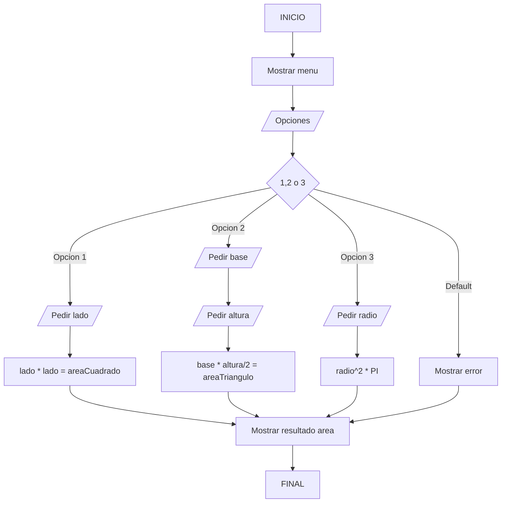

# Boletin 8

---


---
## Diagrama de flujo.

###### **Diagrama de el ejercicio 8 del boletín 2.**
7- Codifica un programa que, utilizando un menú de opcións, calcule a superficie de distintas figuras . 
     O usuario premerá a opción desexada .Según ésta o programa pediralle os datos precisos e, utilizando un switch…case visualizará o resultado .
   No caso de premer unha opción que non teña o menú visualizar unha mensaxe de “ opción incorrecta “.

>1…. Cadrado 

>2…. Triangulo

>3…. Circulo 


*Este es el enlace a  [esemtia](https://danielcastelao.esemtia.net/moodle/course/view.php?id=49).*

---
## Peudocódigo.


```
        opcion = introducirOpcion();

        switch (opcion){
            case CUADRADO:
                lado = introducirNumero();
                area = calcularAreaCuadrado(lado);
                mostrarArea(area);
            break;
            case TRIANGULO:
                altura = introducirNumero();
                base = introducirNumero();
                area = calcularAreaTriangulo(base,altura);
                mostrarArea(area);
            break;
            case CIRCUNFERENCIA:
                radio = introducirNumero();
                area = calcularAreaCircunferencia(radio);
                mostrarArea(area);
            break;
            default:
                mostrarMensaje();
```
---
## Estructura del proyecto:


---
## Pasos:

- Crear el proyecto.

- [ ]  Hacer el ordinograma.

- [x] Hacer el pseudocódigo.

- Empezar a programar.
    - [x] Crear clase principal con la estructura.
    - [x] Hacer la clase secundaria con los métodos pedidos en la clase main.

@github/RubenDanielCastelao :+1: 

<!--- mi primer md --->
